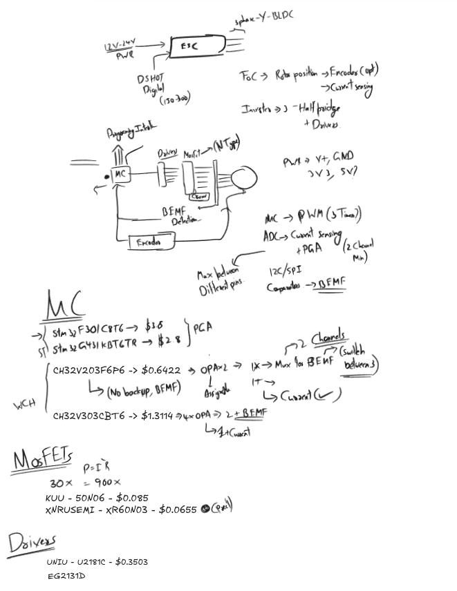
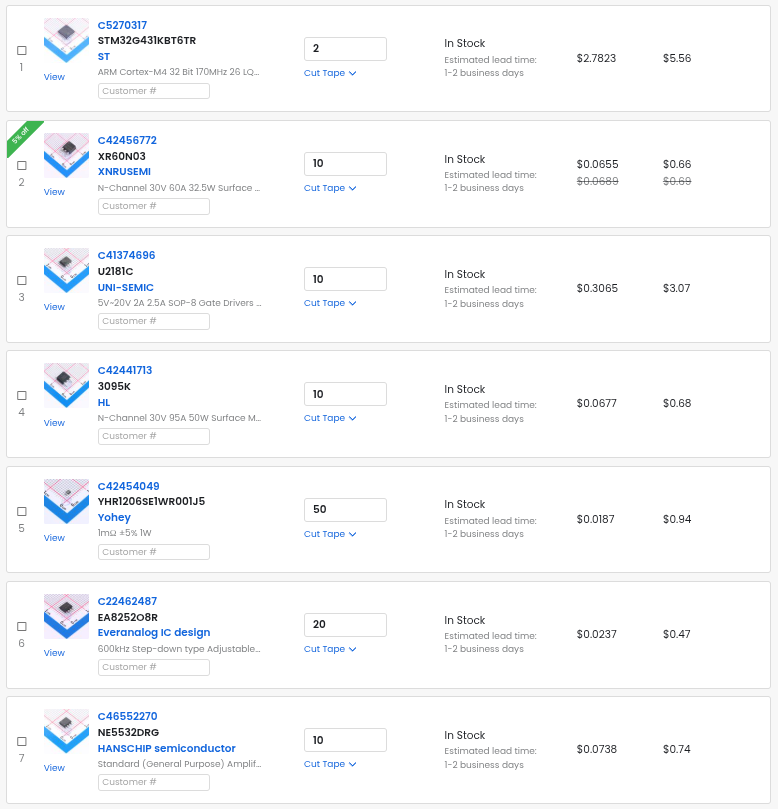

# May 19: Journal-1 (Ideation and Picking Components)
== [Lapse link for this Journal](https://lapse.hackclub.com/timelapse/lf7XQWSmRJG7)

---

In this Journal, I put the basic idea of what the ESC will look like on paper. Helped clear up
and what specifications I should target when shopping for components. Below is the spec I've
decided on.

+ Target Input Voltage: 12-24V (I might revise this to Max 20V because I didn't find cheap Gate Drivers)
+ Input Throttle Method: DSHOT150 (and I2C if possible)
+ Max Current: 30A (Minimum)
+ Control Methods: FoC + BEMF Based 6-Step Commutation
+ Misc: Additional support for encoders incase we want FoC at low speeds

Then I drew a basic block diagram, on which blocks will connect to which components, to plan for
the inputs and peripherals I'm going to need in the Micro-Controller.

=== Micro-Controller

Based on my block diagram I needed the following:

+ Support for Timer which can atleast do 3 Channel PWM
+ ADC for Current Sensing with a Shunt resistor.
  + Would prefer a PGA (Programmable Gain Amplifier), so I have a large dynamic range
  + A fixed gain amp is also fine, but I'd lose out on my measurable current range.
+ Comparator for creating Interrupts in 6-Step Commutation Mode
  + If there are low number of PGAs or CMPs a nice internal MUX would be necessary

Searching for Mixed Signal Micro-Controller families from ST Micro, and cheaper alternatives of
the respective ICs landed me on these choices:

+ STM32F301C8T6 - $3.6
+ STM32G431KBT6TR - $2.8
+ CH32V203F6P6 - $0.64
  + I've rejected this due to it not having a flexible enough pin assignments/channels for CMPs
  + I'll have to settle for a Fixed Gain since, I'll have to use external passives to use CMPs as Amplifiers
+ CH32V303CBT6 - $1.3114
  + It has 4 OPAs so we now don't care about the flexibility, but it still suffers from not having a PGA, at the same time not exposing the outputs of the CMPs so I can't convert them to Amplifiers (I realised this when writing this journal. I'm a genius /s)

So, for now I'm planning to use **STM32G431KBT6TR** since it's cheaper and still do the job.

**Note:** I've also looked at Micro-Controllers from Giga Devices, but their clones seem to be
mostly aimed at replicating the Digital peripheral and capabilities. (Lack of PGA + CMPs) So
they were eleminated too.

=== MosFETs

For find components in this section, I just filtered based on the Max Continuous Drain Current
(Id) to a Minimum of 30A. Then I've further narrowed down the selection based on:

+ Gate Charge
  + Lower the better, since we'll have faster switching for same gate driver.
+ Max Power Dissipation
  + Lower Priority but Higher the better obviously :)
+ Rds ON
  + Lower the better, since we'll waste less power as heat
+ Max Operating Voltage
  + I thought a 30V should be the real minimum for a nice safety buffer
+ Reputability
  + I basically made no progress here, and just picked stuff which had a reasonably good datasheet

Landed on:

+ **50N06** from *KUU* - $0.085
+ XR60N03 from XNRUSEMI - $0.0655
  + I picked this since It had an English Datasheet + Rds ON is too good to pass up

=== Gate Drivers

This is the spot/point where I wasted a lot of time. I was digging the wrong specs at one point
T_T. Most of the datasheets being in Chinese didn't help. Anyways I was searching for the
following spec:

+ Drive Half Bridges with internal Shoot Through Protection
+ Large enough Source + Sink Current
+ Decent Rise + Fall Times
+ Max Input Voltage (Minimum ~ 20V)
  + Most of them don't go to 20V so, I've limited choices
  + If I don't find cheap and reasonable drivers, I'll consider adding an additional 12V rail

I wasn't satisfied with most of the drivers, but for now I think these are reasonable:

+ U2181C from UNIU - $0.35
+ EG2131D from EG Micro - $0.0783

I still want to search for more drivers this time rising my budget for this. I realised I was
being too cheap while journaling. But as a place holder U2181C for it's English datasheet, even
though it's quite expensive to it's competition.

=== Image

---

---

**Note:** Oh, also I'm planning on soldering all the components by myself using an Iron and Hot
Air so, I've avoided using any QFN or it's relative packaging formats since they are really hard
to solder.

**Total time spent: 1 Hour 39 Minutes 45 Seconds**

# May 21: Journal-2 (Picking Components - Passives and Power)
== [lapse link for this journal](https://lapse.hackclub.com/timelapse/4vriV8PPx9Hl)

=== Current Sense Resistors

For this, I need some math done. We already have ~6.5 mOhm as the Rds_on for the MOSFETs I choose.
Technically we could use the mosFETs as the current sense elements except for the variation with
temperature and tolerances/variance from part to part, and most importantly it's dependance on Vgs
(Generates about 5.85W in heat assuming 30A of Id), and I didn't want to waste more power, So I
we need the lowest resistance we can get away with.

For this we really don't need to be that careful except for the fact that we lie inside the
power range/limit (Which is 1W for the component I choose, and for 30A it comes out to be
0.9W), which is pretty high, but the lowest I can go reasonably while considering the current
resolution. A simple calculation using:

$ I_{min}= \frac{V_{LSB}}/{G \cdot R_{sense}} $

gave me a current resolution of 64.4mA (Considering my ENOB will be 10 bits, so it's looking
good so far.)

=== Switching Buck Converter IC

After looking through the available options, I've decided to have a step down to 10-12V instead
of directly to 3.3V as I was planning (I've taken this decision after seeing the lack of options
I had available.), Instead I'll now do an LDO from the 10V I generate?

No, I can't do that,since the buck converter will now approximately have to generate 6A to accommodate
the Gate Drivers, which I don't think I'll be able to do either. So I've stepped down from my target
of accommodating **6S** batteries and I'm now targeting **4S** batteries with a max nominal Voltage
of **16.8V**. With this change I've decided on:

+ EA8252O8R
  + Primarily because it's switching frequency is 600kHz (Which is pretty decent)
  + Doesn't need an external diode (Further reducing my BoM items)
  + Nice to solder SOP8 Package with all the necessary protections built-in.

=== Other exploration

After looking at the cart value, I was quite unsatisfied with how much I would be spending overall
for a single ESC, and I think I might have stumbled upon something really good. Instead of upgrading
to a Mixed Signal Micro-Controller like the **STM32G431KBT6TR**, I could add the analog capabilities
to a normal interconnectivity based Micro-Controller, which will isolate the Digital and Analog
Subsystems even more, with a high change of this giving me better results.

The component like **INA2180** has 2 current sense Amplifier channels, and it really isn't that hard
to make something like this on your own, and I looked at OpAmps like **NJM4580** which I think
can take over the job of both **CMPs** and **PGAs** which I originally thought of for the analog
stuff. Also OpAmps like the **NE5532DRG** also look really good regards to this.

+ One down side that I think I would be introducing would be the additional complexity that I would
  be incurring when laying out and routing the PCB. But so far I think we can swap out the expensiver
  controller with something more cheaper.

---

== Image

---

**Total time spent: 1 Hour 22 Minutes 15 Seconds**
